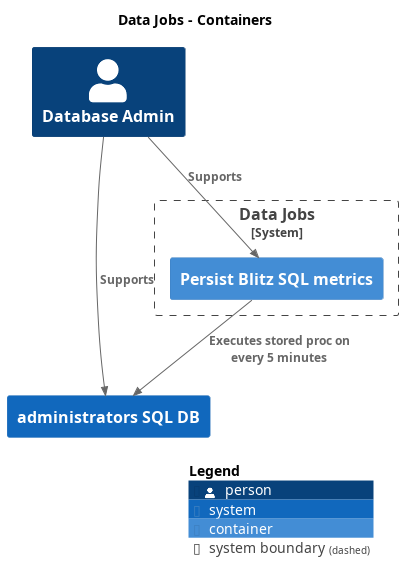

# SQL

To start with, we need to put on our DBA hat and build a solid foundation that has a few levers and knobs for us to tune the instance and perform basic maintenance on it. 

We will target the `2022-CU10-ubuntu-22.04` upstream docker image. We will install [Ola Hallengren's maintenance solution](https://github.com/olahallengren/sql-server-maintenance-solution) for backups, integrity checks and index optimization. We will also install Brent Ozar's [first responder kit](https://github.com/BrentOzarULTD/SQL-Server-First-Responder-Kit) to log some performance metrics which we will ingest into prometheus.

## Data jobs

- [SQL](#sql)
  - [Data jobs](#data-jobs)
    - [Persist Blitz](#persist-blitz)
  - [Datawarehouse](#datawarehouse)
  

### Persist Blitz

This job executes the `sp_BlitzFirst` procedure on the `[dba]` database. This will write the file, perfmon, and wait stats to tables in the dbo schema. It will also delete old data from those tables, to ensure we are not filling up this operational data store.

Completion of this job can be viewed in grafana with [this link](http://localhost:3001/d/c3e9520f-52dd-462f-9f98-3cdbb4baacfc/system-overview?orgId=1)

## Datawarehouse

More to come here. These diagrams are an end state, and not representative of what is working today

